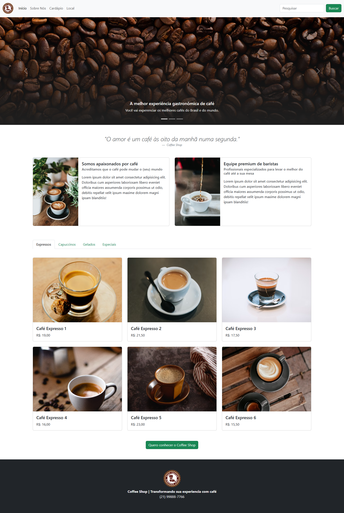
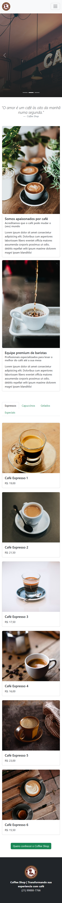

# Projeto CSS - Coffee Shop ☕

## 🧠 Sobre o Projeto

Este projeto foi desenvolvido durante a formação de CSS da [Dio.me](https://www.dio.me/), com o foco em aplicar conceitos de responsividade utilizando o framework **Bootstrap 5**.

A proposta foi simular o site de uma cafeteria fictícia chamada *Coffee Shop*, com um design moderno e responsivo. O layout conta com carrossel de imagens, navegação com âncoras, cards informativos, abas com cardápio de cafés e integração com o Google Maps por meio de um modal.

## 🛠️ Tecnologias Utilizadas

- HTML5  
- CSS3  
- [Bootstrap 5](https://getbootstrap.com/)  
- Google Fonts (via Bootstrap)  
- Unsplash (para imagens)  
- Google Maps Embed  

## ✅ Aprendizados

Neste projeto, foram praticados:

- Criação de layout responsivo com Bootstrap  
- Uso de componentes como:
  - Navbar responsiva com colapso  
  - Carrossel (`carousel`)  
  - Abas de navegação (`tabs`)  
  - Modais (`modal`)  
  - Cards (`card`)  
- Estilização customizada com CSS sob o padrão do Bootstrap  
- Integração de iframe com localização no mapa  

## 🔗 Link do Projeto

📍 [Visualizar projeto no GitHub Pages](https://luis-fellipe.github.io/Coffee-shop-DIO.me-bootstrap/)  

---

## 📸 Prévia

### Versão Desktop  
  
> *Imagem ilustrativa da versão desktop.*

### Versão Mobile  

  
  
<em>Imagem ilustrativa da versão mobile.</em>

---

## 👤 Contato

📎 [Meu LinkedIn](https://www.linkedin.com/in/luis-fellipe-real)
